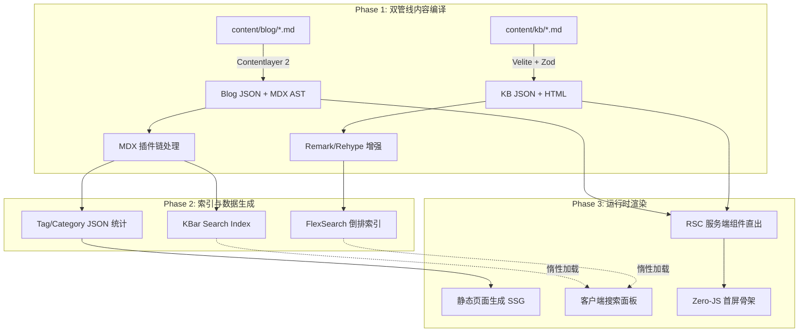

<div align="center">

# COT // 序栈

**知行合一，缄默前行。**<br>
*Knowledge is Practice. Silence is Momentum.*

<br>

[](https://nextjs.org)
[](https://react.dev)
[](https://www.typescriptlang.org)
[](https://tailwindcss.com)
[](./LICENSE)

一个基于 Next.js 16 App Router 构建的全栈技术主页与知识库系统。<br>
博客、知识库、搜索、归档、标签、友链、多语言与 SEO 管线统一在一个架构中。

**[在线预览 blog.cot.wiki](https://blog.cot.wiki)** · [报告 Bug](https://github.com/cotovo/blog/issues)

</div>

---

## 01. 哲学与本源

**序栈（COT）** 是一个面向网络安全、底层原理与全栈架构演进的技术知识沉淀系统。

以编译期定型替代运行时查询，以本地索引替代远程搜索服务，以纯文本 Markdown 替代富文本编辑器。系统本身即是一处展示技术美学的工程标本。

---

## 02. 内核架构



### 双管线内容引擎

| 管线 | 引擎 | 数据源 | 输出 | 核心能力 |
|:-----|:-----|:-------|:-----|:---------|
| **博客** | Contentlayer 2 | `content/blog/**/*.md` | `.contentlayer/generated/` | MDX 渲染、Tag/Category 统计、KBar 索引、RSS |
| **知识库** | Velite | `content/kb/**/*.md` | `.velite/` | Zod Schema 强校验、TOC 提取、类型安全 JSON |

两条管线共享统一的 Remark / Rehype 插件链，各自独立编译、互不干扰。

### MDX 插件链

```text
Remark 层:
  remarkGfm                    → GFM 表格/任务列表/删除线
  remarkAlert                  → GitHub Alerts (> [!NOTE] / [!WARNING])
  remarkCodeTitles             → 代码块标题 (title="xxx")
  remarkProxyExternalImages    → 外部图片代理 + 懒加载
  remarkImgToJsx               → 图片转 JSX 组件

Rehype 层:
  rehypeRemoveFirstH1          → 移除正文首个 H1
  rehypeSlug                   → 自动生成标题锚点 ID
  rehypePrettyCode             → Shiki 代码高亮（行高亮/单词高亮）
  rehypeOptimization           → HTML 结构优化压缩
```

### 构建管线

```text
pnpm build
  ├─ prepare:generated-content   → category-data.json / tag-data.json
  ├─ prepare:kb-content          → Velite 编译知识库 → 类型声明修正
  ├─ prepare:kb-search           → FlexSearch 离线搜索索引
  ├─ contentlayer2 build         → 博客内容编译
  ├─ next build                  → Next.js 编译 + 静态页面生成
  └─ postbuild.ts
       ├─ RSS 生成（多语言）
       ├─ Favicon 同步
       ├─ IndexNow Key 写入
       └─ Standalone 资源拷贝
```

---

## 03. 技术特性

<table>
<tr>
<th width="15%">领域</th>
<th width="18%">技术选型</th>
<th>实现细节</th>
</tr>
<tr>
<td><b>全量检索</b></td>
<td><code>FlexSearch</code> + <code>KBar</code></td>
<td>

摒弃外部 SaaS。预编译阶段抽取纯文本序列化为离线倒排索引 JSON，客户端按需惰性加载，120ms 按键防抖，支持中英双语分词。

</td>
</tr>
<tr>
<td><b>渲染管线</b></td>
<td><code>RSC</code> (React Server Components)</td>
<td>

极致剥离 Client Boundary。除搜索、主题切换、动画等强交互模块外，所有页面骨架由服务端直出。首屏 JS 体积控制在 102KB（shared chunks）。

</td>
</tr>
<tr>
<td><b>多语言</b></td>
<td><code>.en.md</code> 后缀 + <code>LanguageContext</code></td>
td>

中英文内容同源同目录，文件名后缀区分语言。UI 文案通过 i18n 字典全局注入，支持手动语言切换。错误页面、关于页、导航、底栏全部支持中英双语。

</td>
</tr>
<tr>
<td><b>SEO 全链路</b></td>
<td><code>sitemap.ts</code> + <code>robots.ts</code> + <code>jsonld.ts</code></td>
<td>

动态生成 sitemap.xml、robots.txt、JSON-LD 结构化数据（BlogPosting / WebSite / BreadcrumbList）、RSS 多语言订阅源、百度推送 + IndexNow 即时收录。

</td>
</tr>
<tr>
<td><b>微交互</b></td>
<td><code>GSAP</code> + <code>Framer Motion</code></td>
<td>

GSAP ScrollTrigger 驱动视差与滚动入场动画。Framer Motion 负责布局动画、列表 stagger、交互反馈。全站支持 <code>prefers-reduced-motion</code>。iOS 毛玻璃材质统一应用于导航栏与浮动按钮。

</td>
</tr>
<tr>
<td><b>图片管线</b></td>
<td><code>image-proxy</code> + <code>LazyLoad</code></td>
<td>

外部图片自动代理缓存至本地避免热链。MDX 图片构建时注入 <code>loading="lazy"</code>。standalone 模式支持 <code>next/image</code> 动态裁切。

</td>
</tr>
</table>

---

## 04. 源码拓扑

```text
.
├── blog.config.ts                 # 全局单源配置（站点元信息·导航·SEO·展示·备案）
├── contentlayer.config.ts         # 博客内容模型 + MDX 插件链 + Tag/Category 自动生成
├── velite.config.ts               # 知识库内容模型 (Zod Schema)
├── deploy.sh                      # VPS 自引导部署脚本
├── ecosystem.config.cjs           # PM2 进程配置
│
├── content/                       # 核心数据层
│   ├── blog/                      # ├─ 博客文章（.md 中文 / .en.md 英文）
│   ├── kb/                        # └─ 知识库文档
│   └── authors/                   #    作者信息（中英文）
│
├── scripts/                       # 编译管线脚本
│   ├── build/                     # ├─ postbuild.ts / prepare-generated-content.ts / rss.ts
│   ├── build-search-index.js      # ├─ FlexSearch 离线索引构建
│   └── seo-push.ts               # └─ 百度/IndexNow 推送
│
├── src/
│   ├── app/                       # Next.js App Router
│   │   ├── (site)/                # ├─ 主站（首页·博客·标签·归档·友链·关于）
│   │   ├── (app)/                 # ├─ 知识库（Wiki Shell）
│   │   └── api/                   # └─ API 路由
│   │
│   ├── features/                  # 业务功能模块
│   │   ├── content/               # ├─ 内容渲染引擎（组件·布局·工具库）
│   │   ├── site/                  # ├─ 站点通用层（Header·Footer·Hero·Nav·SEO）
│   │   ├── search/                # ├─ KBar 搜索
│   │   ├── comments/              # ├─ 评论区
│   │   └── friends/               # └─ 友链管理
│   │
│   ├── kb/                        # 知识库专用模块
│   ├── shared/                    # 跨模块共享层（i18n·组件·hooks·工具）
│   └── generated/                 # 自动生成数据
│
├── public/                        # 静态资源·favicon·搜索索引·RSS
└── storage/                       # 运行时数据（站点设置 JSON）
```

---

## 05. 部署

### 方法 A：VPS 自引导部署（PM2 + Standalone SSR）

```bash
chmod +x deploy.sh && ./deploy.sh
```

<details>
<summary><b>脚本执行的 22 个阶段</b></summary>

```text
 0. Banner 打印
 1. OS / 架构检测
 2. 端口校验 + STATIC_EXPORT 守卫
 3. Node.js 自动安装 (NodeSource 20 LTS)
 4. Git clone / pull
 5. pnpm 版本锁定安装
 6. PM2 自动安装
 7. corepack 状态修复
 8. 工作目录验证
 9. 部署日志初始化
10. pnpm 版本校验
11. 系统资源预检（磁盘·内存·端口冲突）
12. 配置摘要输出
13. pnpm install --frozen-lockfile
14. esbuild 二进制权限修复
15. .next 备份 + pnpm build
16. 构建产物校验
17. 静态资源拷贝
18. PM2 startOrReload + pm2 save
19. 健康检查（HTTP 2xx）
20. PM2 开机自启
21. 清理备份 + 部署摘要
```

环境变量：`GIT_REPO` · `GIT_BRANCH` · `DEPLOY_DIR` · `APP_PORT` · `APP_DOMAIN` · `NODE_MAJOR`

</details>

### 方法 B：EdgeOne / 静态托管

```bash
STATIC_EXPORT=true pnpm build
# 上传 out/ 目录到对象存储
```

> 静态导出模式下 `next/image` 动态裁切失效。搜索基于客户端 FlexSearch fetch 静态 JSON，功能完整。

### 方法 C：Docker

<details>
<summary><b>查看 Dockerfile</b></summary>

```dockerfile
FROM node:20-alpine AS builder
WORKDIR /app
COPY . .
RUN corepack enable pnpm && pnpm install --frozen-lockfile && pnpm build

FROM node:20-alpine AS runner
WORKDIR /app
ENV NODE_ENV=production
COPY --from=builder /app/.next/standalone ./
COPY --from=builder /app/.next/static ./.next/static
COPY --from=builder /app/public ./public

EXPOSE 3010
ENV PORT=3010
ENV HOSTNAME=0.0.0.0
CMD ["node", "server.js"]
```

</details>

---

## 06. 快速开始

- `Node.js >= 20`
- `pnpm >= 10`（通过 `corepack enable` 激活）

```bash
git clone https://github.com/cotovo/blog.git
cd blog
pnpm install
pnpm dev
# http://127.0.0.1:3000
```

---

## 07. 内容约定

| 类型 | 路径 | 命名规则 | 备注 |
|:-----|:-----|:---------|:-----|
| 博客 | `content/blog/` | `标题.md` / `标题.en.md` | frontmatter: title · date · tags · categories |
| 知识库 | `content/kb/<分类>/` | `序号-主题.md` | Velite Zod Schema 强校验 |
| 作者 | `content/authors/` | `default.md` / `default.en.md` | 社交链接、技术栈、头像 |

多语言通过 `.en.md` 后缀区分，路由自动解析 `en/` 前缀。

---

## 08. 配置

所有站点配置集中在 **`blog.config.ts`**：

```text
site          站点标题·描述·URL·语言·仓库地址
branding      Logo·Favicon·OG Image·Manifest
navigation    顶部导航菜单项与链接
search        搜索引擎配置（KBar 索引路径）
analytics     Google Tag Manager
beian         ICP / 公安备案号
hero          首页 Hero 展示文案与社交主题
home          首页内容区块配置
footer        页脚展示文案
techStack     技术栈图标映射
```

---

## 09. 工程契约

1. **预编译验证**：提交前必须通过 `pnpm build` 无警告。
2. **原子化提交**：Conventional Commits 前缀，Body 阐述背景与影响。
3. **零副作用**：禁止顺手重构无关模块。一次提交只包含一个意图。
4. **最小依赖**：拒绝非必要的外部包引入。

---

## 10. License

**COT // 序栈** 遵循 [GPL-3.0](./LICENSE) 开源协议。

<br>
<div align="center">
  <b>SYSTEM ONLINE // END OF FILE</b>
</div>
