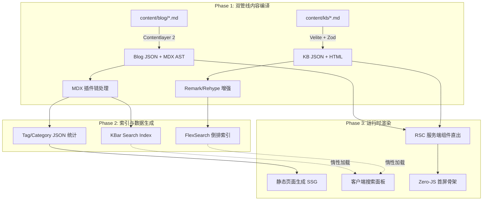

<div align="center">

# COT // 序栈

**知行合一，缄默前行。**<br>
*Knowledge is Practice. Silence is Momentum.*

<br>

[](https://github.com/cotovo/homepage/stargazers)
[](https://github.com/cotovo/homepage/network/members)
[](https://nextjs.org)
[](https://react.dev)
[](https://www.typescriptlang.org)
[](https://tailwindcss.com)
[](./LICENSE)

一个基于 Next.js 15 构建的全栈技术主页与知识库系统。<br>
博客、知识库、搜索、归档、标签、友链与 SEO 管线统一在一个 App Router 架构中。

**[在线预览 cot.wiki](https://cot.wiki)** · [报告 Bug](https://github.com/cotovo/homepage/issues)

</div>

---

## 01. THE PHILOSOPHY // 哲学与本源

**序栈（COT）** 是一个面向网络安全、底层原理与全栈架构演进的技术知识沉淀系统。

当代博客系统充斥着黑盒化封装、过重的客户端渲染（CSR）以及对第三方 SaaS 的过度依赖。本项目试图回归本质：以编译期定型替代运行时查询，以本地索引替代远程搜索服务，以纯文本 Markdown 替代富文本编辑器。系统本身即是一处展示技术美学的工程标本——从 MDX 插件链到字体排印，从搜索索引到部署管线，每一行代码都以极严苛的标准重塑。

这不是一个简单的文档站。这是一场关于如何构筑现代高性能阅读体验的技术推演。

---

## 02. CORE ARCHITECTURE // 内核架构矩阵

本系统完全抛弃了传统的数据库动态查询模型（RDBMS / NoSQL），基于 **Next.js App Router** 构建了完全在编译期定型的极速混合型架构。



### 2.1 双管线内容引擎

本系统同时运行两条独立的内容管线，各自服务不同的内容类型：

| 管线 | 引擎 | 数据源 | 输出 | 核心能力 |
|:-----|:-----|:-------|:-----|:---------|
| **博客管线** | Contentlayer 2 | `content/blog/**/*.md` | `.contentlayer/generated/` | MDX 渲染、Tag/Category 统计、KBar 索引、RSS 生成 |
| **知识库管线** | Velite | `content/kb/**/*.md` | `.velite/` | Zod Schema 强校验、TOC 提取、类型安全 JSON |

两条管线共享统一的 Remark / Rehype 插件链，但各自独立编译、独立输出，互不干扰。

### 2.2 MDX 插件链

```text
Remark 层:
  remarkGfm              → GFM 表格/任务列表/删除线
  remarkAlert            → GitHub Alerts (> [!NOTE] / [!WARNING])
  remarkDirective        → 自定义指令语法
  remarkCodeTitles       → 代码块标题 (title="xxx")
  remarkProxyExternalImages → 外部图片代理 + 懒加载
  remarkImgToJsx         → 图片转 JSX 组件

Rehype 层:
  rehypeRemoveFirstH1    → 移除正文首个 H1（避免与标题重复）
  rehypeSlug             → 自动生成标题锚点 ID
  rehypePrettyCode       → Shiki 代码高亮（支持行高亮/单词高亮）
  rehypeOptimization     → HTML 结构优化压缩
  rehypePresetMinify     → 生产环境 HTML 压缩
```

### 2.3 构建后处理管线

```text
pnpm build
  ├─ prepare:generated-content   → 生成 category-data.json / category-labels.json
  ├─ prepare:kb-content          → Velite 编译知识库 → 类型声明修正
  ├─ prepare:kb-search           → FlexSearch 构建离线搜索索引
  ├─ next build                  → Next.js 编译 + 静态页面生成
  └─ postbuild.ts
       ├─ RSS 生成                → 多语言 RSS feed
       ├─ Favicon 同步            → 品牌 favicon 覆盖
       ├─ IndexNow Key 写入       → 搜索引擎即时推送
       └─ Standalone 资源拷贝     → .next/static + public → standalone/
```

---

## 03. TECHNICAL INNOVATIONS // 技术革新矩阵

<table>
<tr>
<th width="15%">领域模块</th>
<th width="18%">核心技术选型</th>
<th>架构实现细节</th>
</tr>
<tr>
<td><b>全量检索</b></td>
<td><code>FlexSearch</code> + <code>KBar</code></td>
<td>

摒弃 Algolia / Elasticsearch 等外部 SaaS。在预编译阶段抽取纯文本并序列化为离线倒排索引 JSON。客户端按需惰性加载，<code>120ms</code> 按键防抖，支持中英双语分词。搜索直接 fetch 静态 JSON 文件，SSR / 静态导出双模式兼容。

</td>
</tr>
<tr>
<td><b>渲染管线</b></td>
<td><code>RSC</code> (React Server Components)</td>
<td>

极致剥离 Client Boundary。除搜索面板、主题切换、动画组件等强交互模块外，所有页面骨架均由服务端一次性直出。首屏 JS 体积控制在 <b>102KB</b>（shared chunks），消灭白屏时间。

</td>
</tr>
<tr>
<td><b>多语言</b></td>
<td><code>.en.md</code> 后缀约定</td>
<td>

中英文内容同源同目录，通过文件名后缀区分语言。路由层自动解析 slug 前缀（<code>en/</code>），导航与 UI 文案通过 <code>LanguageContext</code> 全局注入，支持浏览器语言自动检测。

</td>
</tr>
<tr>
<td><b>SEO 全链路</b></td>
<td><code>sitemap.ts</code> + <code>robots.ts</code> + <code>jsonld.ts</code></td>
<td>

动态生成 sitemap.xml（含博客/知识库/标签/分类全量 URL），robots.txt 智能规则，JSON-LD 结构化数据（BlogPosting / WebSite / BreadcrumbList），RSS 多语言订阅源，百度推送 + IndexNow 即时收录。

</td>
</tr>
<tr>
<td><b>微交互学</b></td>
<td><code>GSAP</code> + <code>Framer Motion</code> + <code>Lenis</code></td>
<td>

首页 Hero 引入 GSAP 物理阻尼动画与 GPU 硬件加速。页面过渡使用 Framer Motion 布局动画。全站平滑滚动由 Lenis 驱动。容器卡片采用 <code>backdrop-blur</code> 磨砂拟态。

</td>
</tr>
<tr>
<td><b>图片管线</b></td>
<td><code>image-proxy</code> + <code>LazyLoad</code></td>
<td>

外部图片自动通过 <code>/api/image</code> 代理缓存至本地，避免热链。MDX 中的图片在构建时自动注入 <code>loading="lazy"</code> 属性。standalone 模式下支持 <code>next/image</code> 动态裁切。

</td>
</tr>
</table>

---

## 04. REPOSITORY TOPOLOGY // 源码工程拓扑

理解本系统的核心机理，从熟悉以下目录树开始：

```text
.
├── blog.config.ts                 # 全局单源配置（站点元信息·导航·SEO·展示·备案）
├── contentlayer.config.ts         # 博客内容模型定义 + MDX 插件链 + Tag/Category 自动生成
├── velite.config.ts               # 知识库内容模型定义 (Zod Schema)
├── deploy.sh                      # VPS 自引导部署脚本（环境安装·构建·PM2·健康检查·回滚）
├── ecosystem.config.cjs           # PM2 进程配置（standalone server.js 入口）
│
├── content/                       # 核心数据层：Markdown / MDX 技术原稿
│   ├── blog/                      # ├─ 博客文章（.md 中文 / .en.md 英文）
│   ├── kb/                        # │  ├─ c-modern-approach/  C 语言现代方法
│   │                              # │  ├─ c-notes/            C 语言笔记
│   │                              # │  ├─ c-review/           C 语言复习
│   │                              # │  ├─ c-traps/            C 陷阱与缺陷
│   │                              # │  └─ c-games/            C 语言实战
│   └── authors/                   # └─ 作者信息（中英文）
│
├── scripts/                       # 编译管线附属组件
│   ├── build/                     # ├─ postbuild.ts (RSS·Favicon·IndexNow·standalone 拷贝)
│   │                              # ├─ prepare-generated-content.ts (Category/Tag JSON)
│   │                              # └─ rss.ts (多语言 RSS 生成)
│   ├── build-search-index.js      # ├─ FlexSearch 离线倒排索引构建
│   └── seo-push.ts               # └─ 百度/IndexNow 搜索引擎推送
│
├── src/
│   ├── app/                       # Next.js App Router 全局路由协议
│   │   ├── (site)/                # ├─ 主站路由组
│   │   │   ├── page.tsx           # │  ├─ 首页 (Hero + 最新内容)
│   │   │   ├── blog/              # │  ├─ 博客列表·分类·分页
│   │   │   ├── tags/              # │  ├─ 标签筛选·分页
│   │   │   ├── archive/           # │  ├─ 时间线归档
│   │   │   ├── friends/           # │  ├─ 友链墙
│   │   │   └── about/             # │  └─ 关于页（作者信息展示）
│   │   ├── (app)/                 # ├─ 知识库路由组（Wiki Shell）
│   │   ├── (marketing)/           # ├─ 营销页面（发刊词）
│   │   └── api/                   # └─ API 路由
│   │
│   ├── features/                  # 业务功能模块（按领域划分）
│   │   ├── content/               # ├─ 内容渲染引擎
│   │   │   ├── components/        # │  ├─ MDXComponents·CodeBlock·TOC·PostHero·Pagination
│   │   │   ├── layouts/           # │  ├─ PostLayout·PostBanner·PostSimple·ListLayout
│   │   │   └── lib/               # │  └─ post-utils·post-categories·markdown-renderer·rehype-*
│   │   ├── site/                  # ├─ 站点通用层
│   │   │   ├── components/        # │  ├─ Header·Footer·Hero·Nav·ThemeSwitch·SplashScreen
│   │   │   ├── lib/               # │  ├─ seo.ts·nav-language.ts
│   │   │   └── services/          # │  └─ site-presentation.ts
│   │   ├── search/                # ├─ KBar 搜索 Provider
│   │   ├── friends/               # ├─ 友链管理
│   │   ├── comments/              # ├─ 评论区（占位）
│   │   └── seo/                   # └─ 搜索引擎推送逻辑
│   │
│   ├── kb/                        # 知识库专用模块
│   │   ├── components/            # ├─ WikiShell·Sidebar·TableOfContents·Search·MobileDrawer
│   │   ├── context/               # ├─ UIContext
│   │   ├── hooks/                 # ├─ useMounted
│   │   └── lib/                   # └─ constants·jsonld·tree·scroll-dispatcher
│   │
│   ├── shared/                    # 跨模块共享层
│   │   ├── components/            # ├─ Link·PageHeader·PageTitle·BrandLogo
│   │   ├── contexts/              # ├─ LanguageContext
│   │   ├── hooks/                 # ├─ useToast·useHorizontalWheelScroll
│   │   └── utils/                 # └─ cn()·i18n·image-proxy·site-url
│   │
│   └── generated/                 # 自动生成数据（Tag/Category 统计 JSON）
│
├── public/                        # 静态资源·favicon·搜索索引·RSS·_headers
└── storage/                       # 运行时数据（SQLite·站点设置 JSON）
```

---

## 05. DEPLOYMENT MATRIX // 全域部署矩阵

系统被设计为高度纯净的交付状态，支持从边缘静态网络到独立物理机的全拓扑部署。

### METHOD A: VPS 自引导部署（PM2 + Standalone SSR）

上传 `deploy.sh` 到 VPS，一键完成全链路：

```bash
chmod +x deploy.sh && ./deploy.sh
```

<details>
<summary><b>脚本执行的 22 个阶段</b></summary>

```text
 0. Banner 打印
 1. OS / 架构检测 (Ubuntu / Debian / CentOS / Alpine / macOS / WSL)
 2. 端口校验 + STATIC_EXPORT=true 守卫
 3. Node.js 自动安装 (NodeSource 20 LTS)
 4. Git clone / pull 仓库
 5. pnpm 版本锁定安装 (从 package.json packageManager 读取)
 6. PM2 自动安装
 7. corepack 状态修复 + 残留清理
 8. 工作目录验证 (package.json + ecosystem.config.cjs)
 9. 部署日志 tee 初始化
10. pnpm 版本与 packageManager 字段校验
11. 系统资源预检 (磁盘·内存·ulimit·端口冲突·noexec 挂载)
12. 配置摘要输出
13. pnpm install --frozen-lockfile
14. esbuild 二进制权限修复
15. .next 备份 + pnpm build (含内容生成 + standalone 拷贝)
16. 构建产物校验 (.next/standalone/server.js)
17. 静态资源拷贝 (.next/static + public → standalone/)
18. PM2 startOrReload + pm2 save
19. 健康检查 (PM2 进程状态 + HTTP 2xx)
20. PM2 开机自启 (pm2 startup)
21. 清理备份 + 部署摘要
```

环境变量覆盖：`GIT_REPO` · `GIT_BRANCH` · `DEPLOY_DIR` · `APP_PORT` · `APP_DOMAIN` · `NODE_MAJOR`

</details>

### METHOD B: EdgeOne / 静态托管

```bash
# 强制触发 SSG 路由树穷举，将全站坍缩为 HTML/CSS 切片
STATIC_EXPORT=true pnpm build

# 上传 out/ 目录到 EdgeOne 对象存储
```

> **注意**：静态导出模式下 `next/image` 动态裁切管线失效（退化为原始尺寸输出）。搜索基于客户端 FlexSearch 直接 fetch 静态 JSON，功能完整可用。

### METHOD C: Docker 容器化

<details>
<summary><b>查看标准化 Dockerfile</b></summary>

```dockerfile
# 阶段 1: 构建编译
FROM node:20-alpine AS builder
WORKDIR /app
COPY . .
RUN corepack enable pnpm && pnpm install --frozen-lockfile && pnpm build

# 阶段 2: 生产运行时抽离
FROM node:20-alpine AS runner
WORKDIR /app
ENV NODE_ENV=production
COPY --from=builder /app/.next/standalone ./
COPY --from=builder /app/.next/static ./.next/static
COPY --from=builder /app/public ./public

EXPOSE 3010
ENV PORT=3010
ENV HOSTNAME=0.0.0.0
CMD ["node", "server.js"]
```

</details>

---

## 06. QUICK START // 极速装配指南

确保终端已具备以下环境：
- `Node.js >= 20`
- `pnpm >= 10`（通过 `corepack enable` 激活）

```bash
# 1. 克隆仓库
git clone https://github.com/cotovo/homepage.git
cd homepage

# 2. 安装依赖
pnpm install

# 3. 启动开发沙箱（Turbopack HMR + 内容热更新）
pnpm dev

# 系统将启动于 http://127.0.0.1:3000
# 后台实时监听 content/ 目录变更并自动重编译
```

---

## 07. CONTENT CONVENTION // 内容创作约定

| 内容类型 | 存储路径 | 命名规则 | 备注 |
|:---------|:---------|:---------|:-----|
| 博客文章 | `content/blog/` | `标题.md` / `标题.en.md` | frontmatter: `title` · `date` · `tags` · `categories` |
| 知识库文档 | `content/kb/<分类>/` | `序号-主题.md` | Velite Zod Schema 强校验，构建期类型检查 |
| 作者信息 | `content/authors/` | `default.md` / `default.en.md` | 社交链接、技术栈、头像 |

多语言内容通过文件名后缀 `.en.md` 区分，路由层自动解析 slug 前缀 `en/`。

---

## 08. CONFIGURATION // 配置中心

所有站点配置集中在 **`blog.config.ts`**，一处修改全局生效：

```text
site        站点标题·描述·URL·语言·仓库地址
branding    Logo·Favicon·OG Image·Manifest
navigation  顶部导航菜单项与链接
search      搜索引擎配置（KBar 索引路径）
analytics   Google Tag Manager
beian       ICP / 公安备案号
hero        首页 Hero 展示文案与社交主题
home        首页内容区块配置
footer      页脚展示文案
techStack   技术栈图标映射
```

---

## 09. ENGINEERING CONTRACT // 工程协作契约

所有向本仓库发起的 PR 必须遵守以下纪律：

1. **预编译验证墙**：提交前必须在本地无警告通过 `pnpm typecheck` + `pnpm build`。
2. **原子化提交**：严格采用 Conventional Commits 前缀，Body 阐述背景与影响：
   ```text
   feat(search): 直接 fetch 静态搜索索引，支持静态导出模式
   refactor(content): 抽取 getPostSourcePath 共享工具函数，消除四处重复
   fix(deploy): 修复 pnpm 版本兼容性，从 package.json 读取精确版本
   ```
3. **零副作用原则**：禁止顺手重构无关模块。一次提交只包含一个意图。
4. **最小依赖**：拒绝一切非必要的外部包引入。如确有必要，须在 PR 中说明体积影响。

---

## 10. LICENSE

**COT // 序栈** 遵循 [GPL-3.0](./LICENSE) 开源协议。

<br>
<div align="center">
  <b>SYSTEM ONLINE // END OF FILE</b>
</div>
